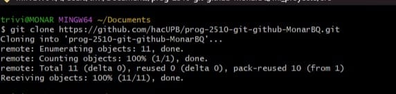

# Bitácora
Nombre del estudiante: Juan Jose Monar Triviño 
Id.: 000549352
# Proyecto 1
## Descripción
Este es un trabajo donde se aprenden y visualizan las bases de como se debe estructurar un proyecto con sus respectivas carpetas y archivos basicos, utilizando con los conceptos aprendidos en clase del manejo de Git.
## Ejecución
Para ejecutar este trabajo se siguieron los siguientes pasos claves:
1. Cree una carpeta en mi dispositivo con el mismo nombre del repositorio que me entrego el profesor 
2. Clone el repositorio en mi dispositivo usando el siguiente codigo

   git clone URL del repositorio

   

3. Aplique los conocimientos adquiridos en clase para desarrollar todos los puntos del trabajo.

## Tabla de contenido 
|Archivos en la carpeta docs| 
|--------------|
|[Informacion de un repositorio local](./docs/repositorio_local.md)
|[Informacion de un repositorio remoto](./docs/repositorio_remoto.md)
|[Conceptos para el uso de la consola](./docs/uso_consola.md)|