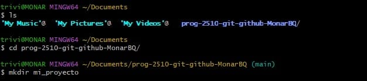

# Conceptos para el uso de la consola

## Sistema de control de versión
Es un software que te permite ir guardando un historial de los cambios que le vas haciendo a tus archivos a lo largo del tiempo, sin tener que preocuparte por dañar algo o recuperar algo que ya habias hecho antes, un ejemplo de un sistema de control de versión es Git que es con el cual se realizo este trabajo.

### Navegación y creación de archivos y directorios
Con GitBash usamos ciertos codigos con los que nos movemos entre una ubicacion del computador a otra y codigos con los que creamos directorios y archivos, entre esos codigos tenemos los siguientes:

```pwd``` 

(Para conocer el directorio donde estas)

```ls``` 

(Para mostrar los directorios o archivos que hay)

```cd nombre del directorio```

(Para entrar a un directorio)

```mkdir nombre del directorio```

(Para crear un directorio)

```touch nombre del archivo```

(Para crear un archivo)

```find . -nombre del archivo```

(Para buscar un archivo)

  


Estos son los codigos mas basicos para navegar y crear archivos y directorios en tu computador con la ayuda de GitBash.
